<a href="https://www.bigdatauniversity.com"></a>

<h1 align=center><font size = 5>BASIC PLOTS</font></h1>

<hr>


## Table of Contents


<div class="alert alert-block alert-info" style="margin-top: 20px">
<li><p><a href="#ref0">The importance of graphs</a></p></li>
<li style="margin-left: 40px;"><p><a href="#ref1">The difference between R libraries</a></p></li>
<li style="margin-left: 40px;"><p><a href="#ref2">Qualitative vs Quantitative Data</a></p></li>
<li><p><a href="#ref3">The `mtcars` dataset</a></p></li>
<li><p><a href="#ref4">Bar Plots</a></p></li>
<li><p><a href="#ref5">Histograms</a></p></li>
<li><p><a href="#ref6">Pie Charts</a></p></li>
<br>
<p></p>
Estimated Time Needed: <strong>20 min</strong>
</div>

<hr>

<a id="ref0"></a>
<h2 align=center>The importance of graphs</h2>
<br>
Data visualization is the presentation of data with graphics. It's a way to summarize your findings and display it in a form that facilitates interpretation and can help in identifying patterns or trends.
Having great data visualizations will make your work more interesting and clear.
In this course, you will learn how to use the ggplot2 library to create beautiful graphics and charts, customizing the look and feel of them as you wish.

### The difference between R libraries<a id="ref1"></a>

The differences between the basic plot() library, that comes with R, and ggplot2 are many.
Ggplot2 was created to attend design demands and was based on the book "The Grammar of Graphics", a book that describes the foundations for data plotting.

Let's look at the differences between them using a simple example.

### plot
The `plot` library is the default R library for plotting graphs. It's very simplistic in both syntax and aesthetics. To use it to create a bar plot, you use the `barplot` function, like so:


```R
count <- table(mtcars$cyl)
barplot(count)
```


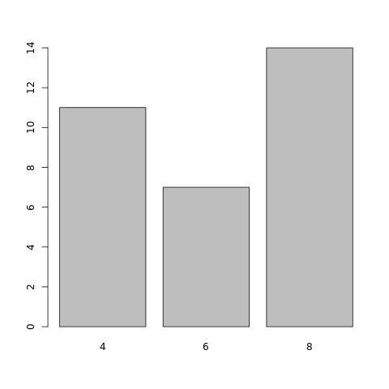


### ggplot2
`ggplot2`, as mentioned above, is a specialized library made to create visually pleasing data visualizations.
Before we can use `ggplot2`, we need to import it into the R environment.
The code cell below will check if your system already has ggplot, as to not run `install.packages` for no reason. Then, using the `library` function, we can then import `ggplot2`.


```R
if("ggplot2" %in% rownames(installed.packages()) == FALSE) {install.packages("ggplot2")}
library(ggplot2)
```

Now, let's plot our graph. To plot a simple bar graph using `ggplot2`'s `qplot`, we use this:


```R
qplot(mtcars$cyl, geom = "bar")
```


    


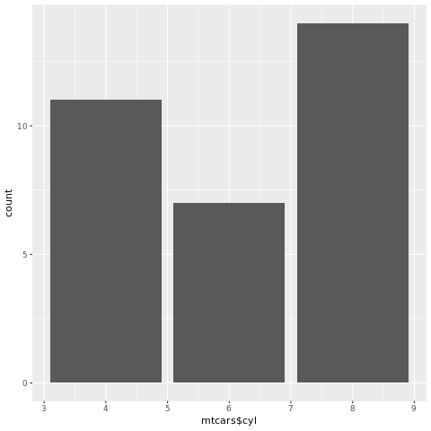


Don't worry - we will go back and learn these and other plotting methods during our lessons.

As you can see, `ggplot2` offers us a nicer-looking graph, but has a slightly more complex syntax than the default `plot` library.

#### ggplot2 have two principal functions, `qplot()` and `ggplot()`.

   • `qplot()` offers a simpler syntax similar to the default `plot` function, but is limited in customization.

   • `ggplot()` is the full-fledged function. It has far more possible customizations, but has a more complicated syntax than `qplot()`.

In this course, we will start using `qplot()` and then change to `ggplot()` as you advance.

The next graph is a demonstration of what is possible to do with `ggplot()`. In the end of this course you will be able to create graphs like this one below and even more complex ones. 


```R
ggplot(data= mtcars, aes(mtcars$hp))  + 
  geom_histogram(breaks=seq(40, 350, by = 25),  
                 colour = I("black"),
                 aes(fill=..count..))
```


    


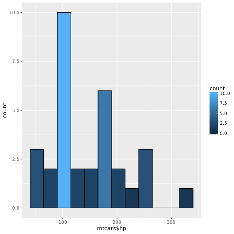


### Qualitative vs Quantitative Data<a id="ref2"></a>
One thing to always keep in mind is the type of data which you are trying to create graphs for. In general, we categorize data in two big groups: Qualitative data (also called Categorical data) and Quantitative data (also called Numerical data).

What we refer to as **qualitative or categorical** data is data that refers to, as seen from its name, categories. This can include data for "Yes or No" questions, it could be the name of a location, it could be a person's favourite ice cream flavour, or it could be something else. It's something very distinct from **quantitative or numerical** data. Quantitative data is data that is, quite simply, numbers. It normally is a measurement of some sort, and can be manipulated using simple math.

The plotting methods and the best types of chart for each type of data are different - choosing the best one will help you greatly in creating visually pleasant graphs.

<hr>

<a id="ref3"></a>
<h2 align=center>The mtcars dataset</h2>
<br>
`mtcars` is an inbuilt dataset that contains data from the 1974 Motor Trend US magazine, and contains fuel consumption and 10 other aspects of automobile performance for 32 automobiles from 1973–74.

Since it is already included with R, there is no need to import `mtcars`. Let's check its structure - we can do so by calling it by its name, like so:


```R
mtcars
```


                         mpg cyl  disp  hp drat    wt  qsec vs am gear carb
    Mazda RX4           21.0   6 160.0 110 3.90 2.620 16.46  0  1    4    4
    Mazda RX4 Wag       21.0   6 160.0 110 3.90 2.875 17.02  0  1    4    4
    Datsun 710          22.8   4 108.0  93 3.85 2.320 18.61  1  1    4    1
    Hornet 4 Drive      21.4   6 258.0 110 3.08 3.215 19.44  1  0    3    1
    Hornet Sportabout   18.7   8 360.0 175 3.15 3.440 17.02  0  0    3    2
    Valiant             18.1   6 225.0 105 2.76 3.460 20.22  1  0    3    1
    Duster 360          14.3   8 360.0 245 3.21 3.570 15.84  0  0    3    4
    Merc 240D           24.4   4 146.7  62 3.69 3.190 20.00  1  0    4    2
    Merc 230            22.8   4 140.8  95 3.92 3.150 22.90  1  0    4    2
    Merc 280            19.2   6 167.6 123 3.92 3.440 18.30  1  0    4    4
    Merc 280C           17.8   6 167.6 123 3.92 3.440 18.90  1  0    4    4
    Merc 450SE          16.4   8 275.8 180 3.07 4.070 17.40  0  0    3    3
    Merc 450SL          17.3   8 275.8 180 3.07 3.730 17.60  0  0    3    3
    Merc 450SLC         15.2   8 275.8 180 3.07 3.780 18.00  0  0    3    3
    Cadillac Fleetwood  10.4   8 472.0 205 2.93 5.250 17.98  0  0    3    4
    Lincoln Continental 10.4   8 460.0 215 3.00 5.424 17.82  0  0    3    4
    Chrysler Imperial   14.7   8 440.0 230 3.23 5.345 17.42  0  0    3    4
    Fiat 128            32.4   4  78.7  66 4.08 2.200 19.47  1  1    4    1
    Honda Civic         30.4   4  75.7  52 4.93 1.615 18.52  1  1    4    2
    Toyota Corolla      33.9   4  71.1  65 4.22 1.835 19.90  1  1    4    1
    Toyota Corona       21.5   4 120.1  97 3.70 2.465 20.01  1  0    3    1
    Dodge Challenger    15.5   8 318.0 150 2.76 3.520 16.87  0  0    3    2
    AMC Javelin         15.2   8 304.0 150 3.15 3.435 17.30  0  0    3    2
    Camaro Z28          13.3   8 350.0 245 3.73 3.840 15.41  0  0    3    4
    Pontiac Firebird    19.2   8 400.0 175 3.08 3.845 17.05  0  0    3    2
    Fiat X1-9           27.3   4  79.0  66 4.08 1.935 18.90  1  1    4    1
    Porsche 914-2       26.0   4 120.3  91 4.43 2.140 16.70  0  1    5    2
    Lotus Europa        30.4   4  95.1 113 3.77 1.513 16.90  1  1    5    2
    Ford Pantera L      15.8   8 351.0 264 4.22 3.170 14.50  0  1    5    4
    Ferrari Dino        19.7   6 145.0 175 3.62 2.770 15.50  0  1    5    6
    Maserati Bora       15.0   8 301.0 335 3.54 3.570 14.60  0  1    5    8
    Volvo 142E          21.4   4 121.0 109 4.11 2.780 18.60  1  1    4    2


What kinds of insights can we get from this data?
We have the cars' mileage per gallon of gas, the number of cylinders, and other attributes.

If there's any column that you don't know what it represents, you can use the `?` function to see the helpfile for this dataset, like so:


```R
?mtcars
```


    


Note that this is only possible because `mtcars` is an inbuilt dataset within R.
Almost no datasets will have helpfiles.
Some datasets that you find on the internet will have a readme file that will describe what every column is depicting. Some will include the name of each column in the dataset. Although these are good practices, you can find datasets with undescriptive names for its columns and datasets with no names at all.

As you may already know, we don't need to view the entire dataset to look how the data is structured. We can use the `head` function to see the first 6 rows of our data.


```R
head(mtcars)
```


                       mpg cyl disp  hp drat    wt  qsec vs am gear carb
    Mazda RX4         21.0   6  160 110 3.90 2.620 16.46  0  1    4    4
    Mazda RX4 Wag     21.0   6  160 110 3.90 2.875 17.02  0  1    4    4
    Datsun 710        22.8   4  108  93 3.85 2.320 18.61  1  1    4    1
    Hornet 4 Drive    21.4   6  258 110 3.08 3.215 19.44  1  0    3    1
    Hornet Sportabout 18.7   8  360 175 3.15 3.440 17.02  0  0    3    2
    Valiant           18.1   6  225 105 2.76 3.460 20.22  1  0    3    1


And we can use `tail` to see the last 6 rows of our data.


```R
tail(mtcars)
```


                    mpg cyl  disp  hp drat    wt qsec vs am gear carb
    Porsche 914-2  26.0   4 120.3  91 4.43 2.140 16.7  0  1    5    2
    Lotus Europa   30.4   4  95.1 113 3.77 1.513 16.9  1  1    5    2
    Ford Pantera L 15.8   8 351.0 264 4.22 3.170 14.5  0  1    5    4
    Ferrari Dino   19.7   6 145.0 175 3.62 2.770 15.5  0  1    5    6
    Maserati Bora  15.0   8 301.0 335 3.54 3.570 14.6  0  1    5    8
    Volvo 142E     21.4   4 121.0 109 4.11 2.780 18.6  1  1    4    2


Let's further analyze our data...
We can get a quick summary of each column using the `summary` function:


```R
summary(mtcars)
```


          mpg             cyl             disp             hp       
     Min.   :10.40   Min.   :4.000   Min.   : 71.1   Min.   : 52.0  
     1st Qu.:15.43   1st Qu.:4.000   1st Qu.:120.8   1st Qu.: 96.5  
     Median :19.20   Median :6.000   Median :196.3   Median :123.0  
     Mean   :20.09   Mean   :6.188   Mean   :230.7   Mean   :146.7  
     3rd Qu.:22.80   3rd Qu.:8.000   3rd Qu.:326.0   3rd Qu.:180.0  
     Max.   :33.90   Max.   :8.000   Max.   :472.0   Max.   :335.0  
          drat             wt             qsec             vs        
     Min.   :2.760   Min.   :1.513   Min.   :14.50   Min.   :0.0000  
     1st Qu.:3.080   1st Qu.:2.581   1st Qu.:16.89   1st Qu.:0.0000  
     Median :3.695   Median :3.325   Median :17.71   Median :0.0000  
     Mean   :3.597   Mean   :3.217   Mean   :17.85   Mean   :0.4375  
     3rd Qu.:3.920   3rd Qu.:3.610   3rd Qu.:18.90   3rd Qu.:1.0000  
     Max.   :4.930   Max.   :5.424   Max.   :22.90   Max.   :1.0000  
           am              gear            carb      
     Min.   :0.0000   Min.   :3.000   Min.   :1.000  
     1st Qu.:0.0000   1st Qu.:3.000   1st Qu.:2.000  
     Median :0.0000   Median :4.000   Median :2.000  
     Mean   :0.4062   Mean   :3.688   Mean   :2.812  
     3rd Qu.:1.0000   3rd Qu.:4.000   3rd Qu.:4.000  
     Max.   :1.0000   Max.   :5.000   Max.   :8.000  


We can get the average for any column using `mean(datasetname$columnname)`, like so:


```R
mean(mtcars$cyl)
```


    [1] 6.1875


<hr>

<a id="ref4"></a>
<h2 align=center>Making Bar Plots</h2>

Let's start our plotting with bar plots. As the name implies, it's a plot format that shows your data using bars.
You probably have seen a lot of them already.

Before actually creating any bar plot, let's import our plotting library, `ggplot2`.
There's no need to execute this block if you already executed the import in "Differences between R Libraries".


```R
if("ggplot2" %in% rownames(installed.packages()) == FALSE) {install.packages("ggplot2")}
library(ggplot2)
```

Now that we have loaded our libraries, let's start plotting. To plot easily using `ggplot2`, we can use the `qplot` function, which has simpler syntax, like so:


```R
qplot(mtcars$cyl, geom = "bar")
```


    


As we can see, we plotted a bar plot, consisting of the count of every element with the same value.
We can now exploit some of the possibilities of `ggplot2`'s `qplot` function.


```R
?qplot
```


    


You don't need to understand how exactly each parameter of the `qplot` function works, but you can always go to the help file to try to find what you need.

Our graph is plain as it stands right now. A plain graph is an excellent choice for academic papers, but for Internet content… simply being gray will not catch people’s attention.
Let's give it some colour using the `colour` and the `fill` parameters.
`colour` will modify the colour of the outline, while `fill` will change the colour of the bars.


```R
qplot(mtcars$cyl, geom = "bar", fill = I("black"), colour = I("red"))
```


    


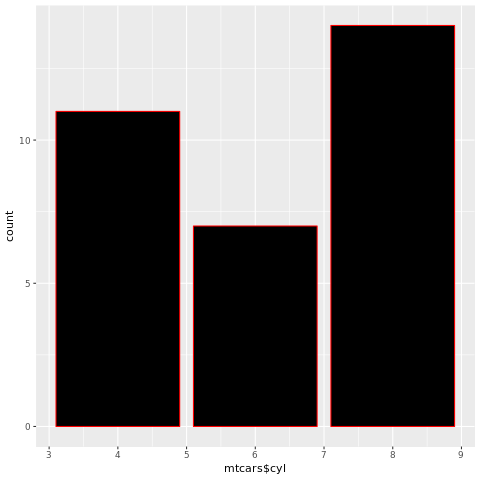


We can just change the fill, as the outline, if no parameter is passed, will receive the same value as the fill one.
You can change the colors to blue, pink, green, yellow...
And there's more colours!
Here's a list: http://sape.inf.usi.ch/quick-reference/ggplot2/colour

We can also change the name of our axes to make it more easily understandable by passing the `xlab` and `ylab` parameters (`lab` stands for "label"):


```R
qplot(mtcars$cyl, geom = "bar", fill = I("blue"), xlab = "Cylinders", ylab = "Number of Vehicles")
```


    


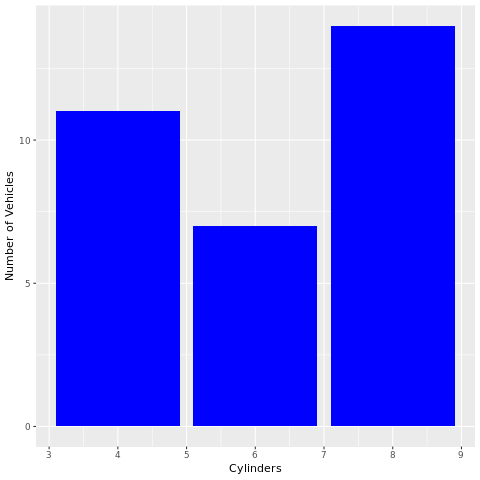


To finish our bar plot, we can give a name for our graph. We can do this using the `main` parameter.


```R
qplot(mtcars$cyl, geom = "bar", fill = I("blue"), xlab = "Cylinders", ylab = "Number of Vehicles", main = "Cylinders in mtcars")
```


    


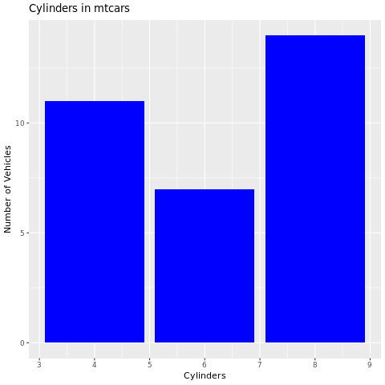


<hr>

<a id="ref5"></a>
<h2 align=center>Histograms</h2>
<br>
Histograms can be defined as a graphical visualization of data counts.
It is a particular type of a bar plot.
A histogram shows the distribution of a quantitative variable. Normally, bar plots are used to compare variables.
Usually, there's no space between the columns of a histogram.

Let's make a simple histogram, selecting the horsepower column from `mtcars`.


```R
qplot(mtcars$hp, geom="histogram")
```

    `stat_bin()` using `bins = 30`. Pick better value with `binwidth`.


    


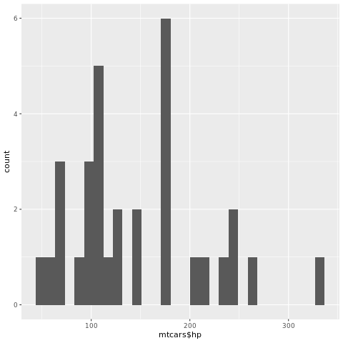


As you executed the code, you may receive the following error message:
`stat_bin()` using `bins = 30`. We can pick better value with `binwidth`.
Binwidth defines the width of your bar.
Let's further improve our histogram, changing our binwidth.


```R
qplot(mtcars$hp, geom="histogram", binwidth = 25)
```


    


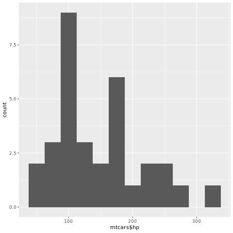


Ok, now each bar has a width of 25 pixels. However, we can see that the visualization of data between 210 and 260 hp are not well illustrated. Again, let's add a black outline to the histogram to make it better to visualize.


```R
qplot(mtcars$hp, geom="histogram", binwidth = 25, colour = I("black"))
```


    


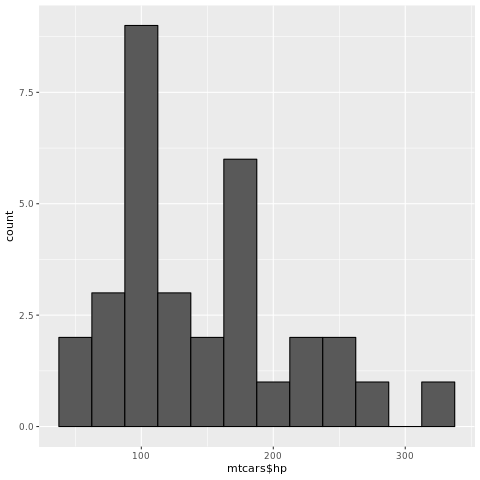


We can also define limits for our x axis. R will fit automatically the best values according to our data, so the result will not change when you use qplot and an adequate limit.


```R
qplot(mtcars$hp, geom="histogram", binwidth = 25, colour = I("black"),xlim=c(50,350))
```


    


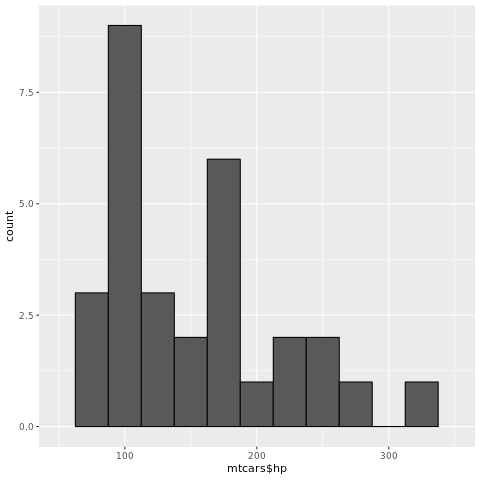


If it happens to "cut" any value, R will display an error message saying how many values are not being shown.
Let's play with xlim values, to see this message. You can put any value that you wish here.


```R
qplot(mtcars$hp, geom="histogram", binwidth = 25, colour = I("black"),xlim=c(80,200))
```

    Warning message:
    : Removed 12 rows containing non-finite values (stat_bin).Warning message:
    : Removed 1 rows containing missing values (geom_bar).


    


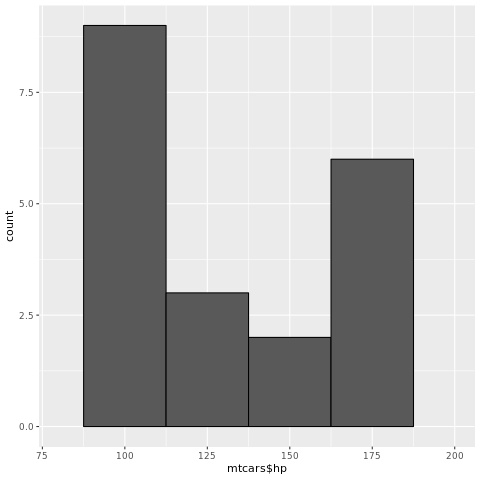


Now let's give a name for our axes. We use the `xlab` and `ylab` parameters to modify them.


```R
qplot(mtcars$hp, geom="histogram", binwidth = 25, colour = I("black"), xlab = "Horsepower", ylab= "Number of Cars")
```


    


We can remove the color that fill our bars using the parameter alpha.


```R
qplot(mtcars$hp, geom="histogram", binwidth = 25, colour = I("black"), xlab = "Horsepower", ylab= "Number of Cars", alpha = I(0))
```


    


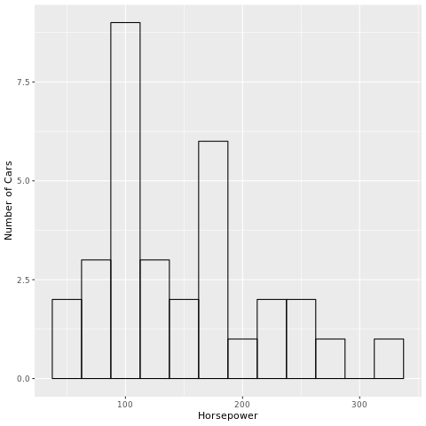


As we did with the bar plot, we can give a name for our graph. We can do this using the `main` parameter.


```R
qplot(mtcars$hp, geom="histogram", binwidth = 25, colour = I("black"), xlab = "Horsepower", ylab= "Number of Cars", alpha = I(0),
     main = "Histogram")
```


    


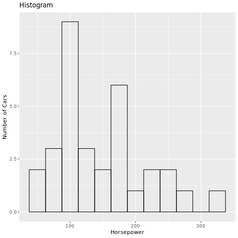


<div class="alert alert-success alertsuccess" style="margin-top: 20px">
<font size = 3><strong>Expert Tip: Sharpening your qplot skills</strong></font>
<br>
<br>
Do you want to check all the qplot function parameters? Click <a href = "http://docs.ggplot2.org/0.9.3/qplot.html">here</a> to access the function documentation !
<p></p>
</div>

<hr>

<a id="ref6"></a>
<h2 align=center>Pie charts</h2>

A pie chart is a circular graph, most commonly used in business. It shows the proportion that each part of data contributes to an overall total. This is usually done as a representation of the counts of qualitative data, like demographics. 

<div class="alert alert-success alertsuccess" style="margin-top: 20px">
<font size = 3><strong>Expert Tip: Choosing the right chart type</strong></font>
<br>
<br>
Unsure which type of chart to use for your data? Click <a href = "http://lifehacker.com/5909501/how-to-choose-the-best-chart-for-your-data">here</a> to learn more !
<p></p>
</div>

A pie chart in ggplot2 is a transformed stacked bar plot. A stacked bar plot is a plot that stacks all the values on the vertical axis, instead of creating separate bars for each different data point.
Let's start by creating a stacked bar plot.


```R
barp <- ggplot(mtcars, aes(x=1, y=sort(mtcars$carb), fill=sort(mtcars$carb))) +
        geom_bar(stat="identity")
print(barp)
```


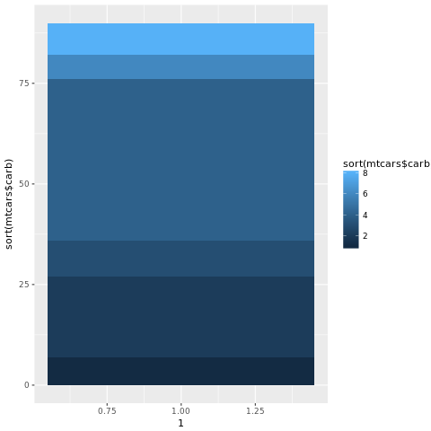


Now we need to transform this graph into a pie plot. We are going to plot our stacked bar graph in the polar coordinates system.

A really nice refresher abour polar coordinates can be seen in the following gif:


Source: <a href="https://commons.wikimedia.org/wiki/File:Cartesian_to_polar.gif">Wikimedia Commons</a>

We use the `coord_polar` helper function to do so:


```R
barp <- barp + coord_polar(theta='y')

print(barp)
```


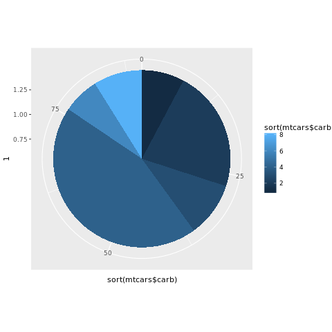


We can use the `theme` helper function so that we don't warp the labels and axes with our transformation:


```R
barp <- barp + coord_polar(theta='y')
barp <- barp + theme(
    axis.line=element_blank(),
    axis.text.x=element_blank(),
    axis.text.y=element_blank(),
    axis.ticks=element_blank(),
    axis.title.y=element_blank())
print(barp)
```


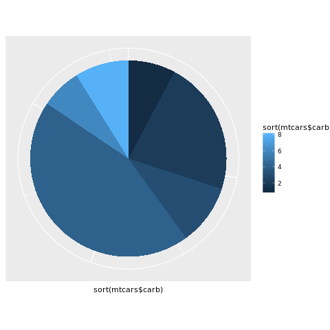


You can notice that we still have an outline around our chart. We can extend the theme function using the `panel.background` parameter:


```R
barp <- barp + coord_polar(theta='y')
barp <- barp + theme(
    axis.line=element_blank(),
    axis.text.x=element_blank(),
    axis.text.y=element_blank(),
    axis.ticks=element_blank(),
    axis.title.y=element_blank(),
    panel.background=element_blank())
print(barp)
```


Now we just need to change our label:


```R
barp <- barp + coord_polar(theta='y')
barp <- barp + theme(
    axis.line=element_blank(),
    axis.text.x=element_blank(),
    axis.text.y=element_blank(),
    axis.ticks=element_blank(),
    axis.title.y=element_blank(),
    panel.background=element_blank()) +
    labs(y="Carburetors")
print(barp)
```


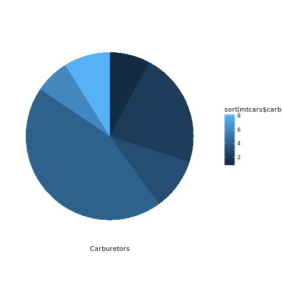


<hr>

### About the Author:  
Hi! It's [Francisco Magioli](https://www.linkedin.com/in/franciscomagioli) and [Erich Natsubori Sato](https://www.linkedin.com/in/erich-natsubori-sato), the authors of this notebook. We hope you found R easy to learn! There's lots more to learn about R but you're well on your way. Feel free to connect with us if you have any questions.

<hr>
Copyright &copy; 2016 [Big Data University](https://bigdatauniversity.com/?utm_source=bducopyrightlink&utm_medium=dswb&utm_campaign=bdu). This notebook and its source code are released under the terms of the [MIT License](https://bigdatauniversity.com/mit-license/).
