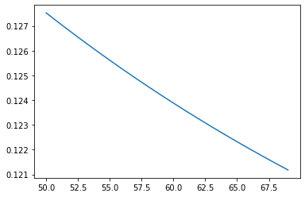

<a href="https://www.skills.network/"></a>


<h2>LOGISTIC REGRESSION WITH TENSORFLOW</h2>

<h3>Objective for this Notebook<h3>    
<h5> 1. What is different between Linear and Logistic Regression?</h5>
<h5> 2. Utilizing Logistic Regression in TensorFlow. </h5>
<h5> 3. Training the model </h5>


## Table of Contents

Logistic Regression is one of most important techniques in data science. It is usually used to solve the classic classification problem.

<div class="alert alert-block alert-info" style="margin-top: 20px">
<font size = 3><strong>This lesson covers the following concepts of Logistics Regression:</strong></font>
<br>
<h2>Table of Contents</h2>

<ol>
    <li><a href="#ref1">Linear Regression vs Logistic Regression</a></li>
    <li><a href="#ref2">Utilizing Logistic Regression in TensorFlow</a></li>
    <li><a href="#ref3">Training</a></li>
</ol>    
</div>
<p></p>
<br>

<hr>


<a id="ref1"></a>

<h2>What is different between Linear and Logistic Regression?</h2>

While Linear Regression is suited for estimating continuous values (e.g. estimating house price), it is not the best tool for predicting the class in which an observed data point belongs. In order to provide estimate for classification, we need some sort of guidance on what would be the <b>most probable class</b> for that data point. For this, we use <b>Logistic Regression</b>.

<div class="alert alert-success alertsuccess" style="margin-top: 20px">
<font size="3"><strong>Recall linear regression:</strong></font>
<br>
<br>
Linear regression finds a function that relates a continuous dependent variable, <i>y</i>, to some predictors (independent variables <i>x1</i>, <i>x2</i>, etc.). Simple linear regression assumes a function of the form:
<br><br>
$$
y = w0 + w1 \times x1 + w2 \times x2 + \cdots
$$
<br>
and finds the values of <i>w0</i>, <i>w1</i>, <i>w2</i>, etc. The term <i>w0</i> is the "intercept" or "constant term" (it's shown as <i>b</i> in the formula below):
<br><br>
$$
Y = W X + b
$$
<p></p>

</div>

Logistic Regression is a variation of Linear Regression, useful when the observed dependent variable, <i>y</i>, is categorical. It produces a formula that predicts the probability of the class label as a function of the independent variables.

Despite the name logistic <i>regression</i>, it is actually a <b>probabilistic classification</b> model. Logistic regression fits a special s-shaped curve by taking the linear regression and transforming the numeric estimate into a probability with the following function:

$$
ProbabilityOfaClass = \\theta(y) = \frac{e^y}{1 + e^y} = exp(y) / (1 + exp(y)) = p 
$$

which produces p-values between 0 (as y approaches minus infinity $-\\infty$) and 1 (as y approaches plus infinity $+\infty$). This now becomes a special kind of non-linear regression.

In this equation, <i>y</i> is the regression result (the sum of the variables weighted by the coefficients), <code>exp</code> is the exponential function and $\\theta(y)$ is the <a href="http://en.wikipedia.org/wiki/Logistic_function">logistic function</a>, also called logistic curve. It is a common "S" shape (sigmoid curve), and was first developed for modeling population growth.

You might also have seen this function before, in another configuration:

$$
ProbabilityOfaClass = \\theta(y) = \frac{1}{1+e^{-y}}
$$

So, briefly, Logistic Regression passes the input through the logistic/sigmoid function but then treats the result as a probability:


* * *


<a id="ref2"></a>

<h2>Utilizing Logistic Regression in TensorFlow</h2>

We begin by installing TensorFlow version 2.2.0 and its required prerequistes.


```python
!pip install grpcio==1.24.3
!pip install tensorflow==2.2.0
```

    Collecting grpcio==1.24.3
    [?25l  Downloading https://files.pythonhosted.org/packages/30/54/c9810421e41ec0bca2228c6f06b1b1189b196b69533cbcac9f71b44727f8/grpcio-1.24.3-cp36-cp36m-manylinux2010_x86_64.whl (2.2MB)
         |████████████████████████████████| 2.2MB 16.5MB/s eta 0:00:01
    [?25hRequirement already satisfied: six>=1.5.2 in /home/jupyterlab/conda/envs/python/lib/python3.6/site-packages (from grpcio==1.24.3) (1.16.0)
    Installing collected packages: grpcio
      Found existing installation: grpcio 1.37.1
        Uninstalling grpcio-1.37.1:
          Successfully uninstalled grpcio-1.37.1
    Successfully installed grpcio-1.24.3
    Collecting tensorflow==2.2.0
    [?25l  Downloading https://files.pythonhosted.org/packages/3d/be/679ce5254a8c8d07470efb4a4c00345fae91f766e64f1c2aece8796d7218/tensorflow-2.2.0-cp36-cp36m-manylinux2010_x86_64.whl (516.2MB)
         |████████████████████████████████| 516.2MB 90kB/s s eta 0:00:01    |██                              | 31.9MB 13.2MB/s eta 0:00:37     |███████████                     | 178.4MB 84.7MB/s eta 0:00:04MB/s eta 0:00:04          | 236.5MB 84.0MB/s eta 0:00:04
    [?25hCollecting opt-einsum>=2.3.2 (from tensorflow==2.2.0)
    [?25l  Downloading https://files.pythonhosted.org/packages/bc/19/404708a7e54ad2798907210462fd950c3442ea51acc8790f3da48d2bee8b/opt_einsum-3.3.0-py3-none-any.whl (65kB)
         |████████████████████████████████| 71kB 35.3MB/s eta 0:00:01
    [?25hCollecting scipy==1.4.1; python_version >= "3" (from tensorflow==2.2.0)
    [?25l  Downloading https://files.pythonhosted.org/packages/dc/29/162476fd44203116e7980cfbd9352eef9db37c49445d1fec35509022f6aa/scipy-1.4.1-cp36-cp36m-manylinux1_x86_64.whl (26.1MB)
         |████████████████████████████████| 26.1MB 44.1MB/s eta 0:00:01
    [?25hRequirement already satisfied: numpy<2.0,>=1.16.0 in /home/jupyterlab/conda/envs/python/lib/python3.6/site-packages (from tensorflow==2.2.0) (1.19.5)
    Collecting keras-preprocessing>=1.1.0 (from tensorflow==2.2.0)
    [?25l  Downloading https://files.pythonhosted.org/packages/79/4c/7c3275a01e12ef9368a892926ab932b33bb13d55794881e3573482b378a7/Keras_Preprocessing-1.1.2-py2.py3-none-any.whl (42kB)
         |████████████████████████████████| 51kB 30.6MB/s eta 0:00:01
    [?25hCollecting tensorflow-estimator<2.3.0,>=2.2.0 (from tensorflow==2.2.0)
    [?25l  Downloading https://files.pythonhosted.org/packages/a4/f5/926ae53d6a226ec0fda5208e0e581cffed895ccc89e36ba76a8e60895b78/tensorflow_estimator-2.2.0-py2.py3-none-any.whl (454kB)
         |████████████████████████████████| 460kB 57.0MB/s eta 0:00:01
    [?25hCollecting google-pasta>=0.1.8 (from tensorflow==2.2.0)
    [?25l  Downloading https://files.pythonhosted.org/packages/a3/de/c648ef6835192e6e2cc03f40b19eeda4382c49b5bafb43d88b931c4c74ac/google_pasta-0.2.0-py3-none-any.whl (57kB)
         |████████████████████████████████| 61kB 32.7MB/s eta 0:00:01
    [?25hRequirement already satisfied: protobuf>=3.8.0 in /home/jupyterlab/conda/envs/python/lib/python3.6/site-packages (from tensorflow==2.2.0) (3.16.0)
    Requirement already satisfied: six>=1.12.0 in /home/jupyterlab/conda/envs/python/lib/python3.6/site-packages (from tensorflow==2.2.0) (1.16.0)
    Collecting astunparse==1.6.3 (from tensorflow==2.2.0)
      Downloading https://files.pythonhosted.org/packages/2b/03/13dde6512ad7b4557eb792fbcf0c653af6076b81e5941d36ec61f7ce6028/astunparse-1.6.3-py2.py3-none-any.whl
    Collecting wrapt>=1.11.1 (from tensorflow==2.2.0)
      Using cached https://files.pythonhosted.org/packages/82/f7/e43cefbe88c5fd371f4cf0cf5eb3feccd07515af9fd6cf7dbf1d1793a797/wrapt-1.12.1.tar.gz
    Collecting h5py<2.11.0,>=2.10.0 (from tensorflow==2.2.0)
    [?25l  Downloading https://files.pythonhosted.org/packages/60/06/cafdd44889200e5438b897388f3075b52a8ef01f28a17366d91de0fa2d05/h5py-2.10.0-cp36-cp36m-manylinux1_x86_64.whl (2.9MB)
         |████████████████████████████████| 2.9MB 48.6MB/s eta 0:00:01
    [?25hRequirement already satisfied: termcolor>=1.1.0 in /home/jupyterlab/conda/envs/python/lib/python3.6/site-packages (from tensorflow==2.2.0) (1.1.0)
    Collecting gast==0.3.3 (from tensorflow==2.2.0)
      Downloading https://files.pythonhosted.org/packages/d6/84/759f5dd23fec8ba71952d97bcc7e2c9d7d63bdc582421f3cd4be845f0c98/gast-0.3.3-py2.py3-none-any.whl
    Requirement already satisfied: absl-py>=0.7.0 in /home/jupyterlab/conda/envs/python/lib/python3.6/site-packages (from tensorflow==2.2.0) (0.12.0)
    Requirement already satisfied: grpcio>=1.8.6 in /home/jupyterlab/conda/envs/python/lib/python3.6/site-packages (from tensorflow==2.2.0) (1.24.3)
    Requirement already satisfied: wheel>=0.26; python_version >= "3" in /home/jupyterlab/conda/envs/python/lib/python3.6/site-packages (from tensorflow==2.2.0) (0.36.2)
    Collecting tensorboard<2.3.0,>=2.2.0 (from tensorflow==2.2.0)
    [?25l  Downloading https://files.pythonhosted.org/packages/1d/74/0a6fcb206dcc72a6da9a62dd81784bfdbff5fedb099982861dc2219014fb/tensorboard-2.2.2-py3-none-any.whl (3.0MB)
         |████████████████████████████████| 3.0MB 56.1MB/s eta 0:00:01
    [?25hRequirement already satisfied: werkzeug>=0.11.15 in /home/jupyterlab/conda/envs/python/lib/python3.6/site-packages (from tensorboard<2.3.0,>=2.2.0->tensorflow==2.2.0) (2.0.0)
    Requirement already satisfied: markdown>=2.6.8 in /home/jupyterlab/conda/envs/python/lib/python3.6/site-packages (from tensorboard<2.3.0,>=2.2.0->tensorflow==2.2.0) (3.3.4)
    Requirement already satisfied: requests<3,>=2.21.0 in /home/jupyterlab/conda/envs/python/lib/python3.6/site-packages (from tensorboard<2.3.0,>=2.2.0->tensorflow==2.2.0) (2.25.1)
    Requirement already satisfied: setuptools>=41.0.0 in /home/jupyterlab/conda/envs/python/lib/python3.6/site-packages (from tensorboard<2.3.0,>=2.2.0->tensorflow==2.2.0) (52.0.0.post20210125)
    Collecting google-auth<2,>=1.6.3 (from tensorboard<2.3.0,>=2.2.0->tensorflow==2.2.0)
    [?25l  Downloading https://files.pythonhosted.org/packages/35/d2/0a79bc7e201c1b38ce46d607eb9398dc362dff1b054c7bba8e4e195c2ed7/google_auth-1.30.1-py2.py3-none-any.whl (146kB)
         |████████████████████████████████| 153kB 70.6MB/s eta 0:00:01
    [?25hCollecting tensorboard-plugin-wit>=1.6.0 (from tensorboard<2.3.0,>=2.2.0->tensorflow==2.2.0)
    [?25l  Downloading https://files.pythonhosted.org/packages/1a/c1/499e600ba0c618b451cd9c425ae1c177249940a2086316552fee7d86c954/tensorboard_plugin_wit-1.8.0-py3-none-any.whl (781kB)
         |████████████████████████████████| 788kB 58.6MB/s eta 0:00:01
    [?25hCollecting google-auth-oauthlib<0.5,>=0.4.1 (from tensorboard<2.3.0,>=2.2.0->tensorflow==2.2.0)
      Downloading https://files.pythonhosted.org/packages/9d/d3/7541e89f1fc456eef157224f597a8bba22589db6369a03eaba68c11f07a0/google_auth_oauthlib-0.4.4-py2.py3-none-any.whl
    Requirement already satisfied: dataclasses; python_version < "3.7" in /home/jupyterlab/conda/envs/python/lib/python3.6/site-packages (from werkzeug>=0.11.15->tensorboard<2.3.0,>=2.2.0->tensorflow==2.2.0) (0.8)
    Requirement already satisfied: importlib-metadata; python_version < "3.8" in /home/jupyterlab/conda/envs/python/lib/python3.6/site-packages (from markdown>=2.6.8->tensorboard<2.3.0,>=2.2.0->tensorflow==2.2.0) (4.0.1)
    Requirement already satisfied: idna<3,>=2.5 in /home/jupyterlab/conda/envs/python/lib/python3.6/site-packages (from requests<3,>=2.21.0->tensorboard<2.3.0,>=2.2.0->tensorflow==2.2.0) (2.10)
    Requirement already satisfied: urllib3<1.27,>=1.21.1 in /home/jupyterlab/conda/envs/python/lib/python3.6/site-packages (from requests<3,>=2.21.0->tensorboard<2.3.0,>=2.2.0->tensorflow==2.2.0) (1.26.4)
    Requirement already satisfied: certifi>=2017.4.17 in /home/jupyterlab/conda/envs/python/lib/python3.6/site-packages (from requests<3,>=2.21.0->tensorboard<2.3.0,>=2.2.0->tensorflow==2.2.0) (2020.12.5)
    Requirement already satisfied: chardet<5,>=3.0.2 in /home/jupyterlab/conda/envs/python/lib/python3.6/site-packages (from requests<3,>=2.21.0->tensorboard<2.3.0,>=2.2.0->tensorflow==2.2.0) (4.0.0)
    Collecting rsa<5,>=3.1.4; python_version >= "3.6" (from google-auth<2,>=1.6.3->tensorboard<2.3.0,>=2.2.0->tensorflow==2.2.0)
      Using cached https://files.pythonhosted.org/packages/e9/93/0c0f002031f18b53af7a6166103c02b9c0667be528944137cc954ec921b3/rsa-4.7.2-py3-none-any.whl
    Collecting cachetools<5.0,>=2.0.0 (from google-auth<2,>=1.6.3->tensorboard<2.3.0,>=2.2.0->tensorflow==2.2.0)
      Using cached https://files.pythonhosted.org/packages/bf/28/c4f5796c67ad06bb91d98d543a5e01805c1ff065e08871f78e52d2a331ad/cachetools-4.2.2-py3-none-any.whl
    Requirement already satisfied: pyasn1-modules>=0.2.1 in /home/jupyterlab/conda/envs/python/lib/python3.6/site-packages (from google-auth<2,>=1.6.3->tensorboard<2.3.0,>=2.2.0->tensorflow==2.2.0) (0.2.8)
    Collecting requests-oauthlib>=0.7.0 (from google-auth-oauthlib<0.5,>=0.4.1->tensorboard<2.3.0,>=2.2.0->tensorflow==2.2.0)
      Using cached https://files.pythonhosted.org/packages/a3/12/b92740d845ab62ea4edf04d2f4164d82532b5a0b03836d4d4e71c6f3d379/requests_oauthlib-1.3.0-py2.py3-none-any.whl
    Requirement already satisfied: zipp>=0.5 in /home/jupyterlab/conda/envs/python/lib/python3.6/site-packages (from importlib-metadata; python_version < "3.8"->markdown>=2.6.8->tensorboard<2.3.0,>=2.2.0->tensorflow==2.2.0) (3.4.1)
    Requirement already satisfied: typing-extensions>=3.6.4; python_version < "3.8" in /home/jupyterlab/conda/envs/python/lib/python3.6/site-packages (from importlib-metadata; python_version < "3.8"->markdown>=2.6.8->tensorboard<2.3.0,>=2.2.0->tensorflow==2.2.0) (3.7.4.3)
    Requirement already satisfied: pyasn1>=0.1.3 in /home/jupyterlab/conda/envs/python/lib/python3.6/site-packages (from rsa<5,>=3.1.4; python_version >= "3.6"->google-auth<2,>=1.6.3->tensorboard<2.3.0,>=2.2.0->tensorflow==2.2.0) (0.4.8)
    Collecting oauthlib>=3.0.0 (from requests-oauthlib>=0.7.0->google-auth-oauthlib<0.5,>=0.4.1->tensorboard<2.3.0,>=2.2.0->tensorflow==2.2.0)
    [?25l  Downloading https://files.pythonhosted.org/packages/05/57/ce2e7a8fa7c0afb54a0581b14a65b56e62b5759dbc98e80627142b8a3704/oauthlib-3.1.0-py2.py3-none-any.whl (147kB)
         |████████████████████████████████| 153kB 64.6MB/s eta 0:00:01
    [?25hBuilding wheels for collected packages: wrapt
      Building wheel for wrapt (setup.py) ... [?25ldone
    [?25h  Stored in directory: /home/jupyterlab/.cache/pip/wheels/b1/c2/ed/d62208260edbd3fa7156545c00ef966f45f2063d0a84f8208a
    Successfully built wrapt
    Installing collected packages: opt-einsum, scipy, keras-preprocessing, tensorflow-estimator, google-pasta, astunparse, wrapt, h5py, gast, rsa, cachetools, google-auth, tensorboard-plugin-wit, oauthlib, requests-oauthlib, google-auth-oauthlib, tensorboard, tensorflow
      Found existing installation: scipy 1.5.3
        Uninstalling scipy-1.5.3:
          Successfully uninstalled scipy-1.5.3
      Found existing installation: h5py 2.8.0
        Uninstalling h5py-2.8.0:
          Successfully uninstalled h5py-2.8.0
      Found existing installation: gast 0.4.0
        Uninstalling gast-0.4.0:
          Successfully uninstalled gast-0.4.0
      Found existing installation: tensorboard 1.8.0
        Uninstalling tensorboard-1.8.0:
          Successfully uninstalled tensorboard-1.8.0
      Found existing installation: tensorflow 1.8.0
        Uninstalling tensorflow-1.8.0:
          Successfully uninstalled tensorflow-1.8.0
    Successfully installed astunparse-1.6.3 cachetools-4.2.2 gast-0.3.3 google-auth-1.30.1 google-auth-oauthlib-0.4.4 google-pasta-0.2.0 h5py-2.10.0 keras-preprocessing-1.1.2 oauthlib-3.1.0 opt-einsum-3.3.0 requests-oauthlib-1.3.0 rsa-4.7.2 scipy-1.4.1 tensorboard-2.2.2 tensorboard-plugin-wit-1.8.0 tensorflow-2.2.0 tensorflow-estimator-2.2.0 wrapt-1.12.1


**Restart kernel for latest version of TensorFlow to be activated**


For us to utilize Logistic Regression in TensorFlow, we first need to import the required libraries. To do so, you can run the code cell below.


```python
import tensorflow as tf
import pandas as pd
import numpy as np
import time
from sklearn.datasets import load_iris
from sklearn.model_selection import train_test_split
import matplotlib.pyplot as plt
```


```python
if not tf.__version__ == '2.2.0':
    print(tf.__version__)
    raise ValueError('please upgrade to TensorFlow 2.2.0, or restart your Kernel (Kernel->Restart & Clear Output)')
```

IMPORTANT! => Please restart the kernel by clicking on "Kernel"->"Restart and Clear Outout" and wait until all output disapears. Then your changes are beeing picked up


Next, we will load the dataset we are going to use. In this case, we are utilizing the <code>iris</code> dataset, which is inbuilt -- so there's no need to do any preprocessing and we can jump right into manipulating it. We separate the dataset into <i>xs</i> and <i>ys</i>, and then into training <i>xs</i> and <i>ys</i> and testing <i>xs</i> and <i>ys</i>, (pseudo)randomly.


<h3>Understanding the Data</h3>

<h4><code>Iris Dataset</code>:</h4>
This dataset was introduced by British Statistician and Biologist Ronald Fisher, it consists of 50 samples from each of three species of Iris (Iris setosa, Iris virginica and Iris versicolor). In total it has 150 records under five attributes - petal length, petal width, sepal length, sepal width and species. <a href="https://archive.ics.uci.edu/ml/datasets/iris">Dataset source</a>

Attributes
Independent Variable

<ul>
    <li>petal length</li>
    <li>petal width</li>
    <li>sepal length</li>
    <li>sepal width</li>
</ul>
Dependent Variable
<ul>    
    <li>Species
        <ul>
            <li>Iris setosa</li>
            <li>Iris virginica</li>
            <li>Iris versicolor</li>
        </ul>
    </li>
</ul>
<br>


```python
iris = load_iris()
iris_X, iris_y = iris.data[:-1,:], iris.target[:-1]
iris_y= pd.get_dummies(iris_y).values
trainX, testX, trainY, testY = train_test_split(iris_X, iris_y, test_size=0.33, random_state=42)
```

Now we define x and y. These variables will hold our iris data (both the features and label matrices) We also need to give them shapes which correspond to the shape of our data. 


```python
# numFeatures is the number of features in our input data.
# In the iris dataset, this number is '4'.
numFeatures = trainX.shape[1]
print('numFeatures is : ', numFeatures )
# numLabels is the number of classes our data points can be in.
# In the iris dataset, this number is '3'.
numLabels = trainY.shape[1]
print('numLabels is : ', numLabels )

#X = tf.Variable( np.identity(numFeatures), tf.TensorShape(numFeatures),dtype='float32') # Iris has 4 features, so X is a tensor to hold our data.
#yGold = tf.Variable(np.array([1,1,1]),shape=tf.TensorShape(numLabels),dtype='float32') # This will be our correct answers matrix for 3 classes.
```

    numFeatures is :  4
    numLabels is :  3


```python
trainX = tf.constant(trainX, dtype='float32')
trainY = tf.constant(trainY, dtype='float32')
testX = tf.constant(testX, dtype='float32')
testY = tf.constant(testY, dtype='float32')
```

<h3>Set model weights and bias</h3>

Much like Linear Regression, we need a shared variable weight matrix for Logistic Regression. We initialize both <code>W</code> and <code>b</code> as tensors full of zeros. Since we are going to learn <code>W</code> and <code>b</code>, their initial value does not matter too much. These variables are the objects which define the structure of our regression model, and we can save them after they have been trained so we can reuse them later.

We define two TensorFlow variables as our parameters. These variables will hold the weights and biases of our logistic regression and they will be continually updated during training. 

Notice that <code>W</code> has a shape of [4, 3] because we want to multiply the 4-dimensional input vectors by it to produce 3-dimensional vectors of evidence for the difference classes. <code>b</code> has a shape of [3] so we can add it to the output. TensorFlow variables need to be initialized with values, e.g. with zeros.


```python
W = tf.Variable(tf.zeros([4, 3]))  # 4-dimensional input and  3 classes
b = tf.Variable(tf.zeros([3])) # 3-dimensional output [0,0,1],[0,1,0],[1,0,0]
```


```python
#Randomly sample from a normal distribution with standard deviation .01

weights = tf.Variable(tf.random.normal([numFeatures,numLabels],
                                       mean=0.,
                                       stddev=0.01,
                                       name="weights"),dtype='float32')


bias = tf.Variable(tf.random.normal([1,numLabels],
                                    mean=0.,
                                    stddev=0.01,
                                    name="bias"))

```

<h3>Logistic Regression model</h3>

We now define our operations in order to properly run the Logistic Regression. Logistic regression is typically thought of as a single equation:

$$
ŷ =sigmoid(WX+b)
$$

However, for the sake of clarity, we can have it broken into its three main components: 

-   a weight times features matrix multiplication operation, 
-   a summation of the weighted features and a bias term, 
-   and finally the application of a sigmoid function. 

As such, you will find these components defined as three separate operations below.


```python
# Three-component breakdown of the Logistic Regression equation.
# Note that these feed into each other.
def logistic_regression(x):
    apply_weights_OP = tf.matmul(x, weights, name="apply_weights")
    add_bias_OP = tf.add(apply_weights_OP, bias, name="add_bias") 
    activation_OP = tf.nn.sigmoid(add_bias_OP, name="activation")
    return activation_OP
```

As we have seen before, the function we are going to use is the <i>logistic function</i> $(\\frac{1}{1+e^{-Wx}})$, which is fed the input data after applying weights and bias. In TensorFlow, this function is implemented as the <code>nn.sigmoid</code> function. Effectively, this fits the weighted input with bias into a 0-100 percent curve, which is the probability function we want.


<hr>


<a id="ref3"></a>

<h2>Training</h2>

The learning algorithm is how we search for the best weight vector (${\\bf w}$). This search is an optimization problem looking for the hypothesis that optimizes an error/cost measure.

<b>What tell us our model is bad?</b>  
The Cost or Loss of the model, so what we want is to minimize that. 

<h3>Cost function</h3>
Before defining our cost function, we need to define how long we are going to train and how should we define the learning rate.


```python
# Number of Epochs in our training
numEpochs = 700

# Defining our learning rate iterations (decay)
learningRate = tf.keras.optimizers.schedules.ExponentialDecay(initial_learning_rate=0.0008,
                                          decay_steps=trainX.shape[0],
                                          decay_rate= 0.95,
                                          staircase=True)
```

<b>What is the cost function in our model?</b>  
The cost function we are going to utilize is the Squared Mean Error loss function.

<b>How to minimize the cost function?</b>  
We can't use <b>least-squares linear regression</b> here, so we will use <a href="http://en.wikipedia.org/wiki/Gradient_descent">gradient descent</a> instead. Specifically, we will use batch gradient descent which calculates the gradient from all data points in the data set.


```python
#Defining our cost function - Squared Mean Error
loss_object = tf.keras.losses.MeanSquaredLogarithmicError()
optimizer = tf.keras.optimizers.SGD(learningRate)
```

We also want some additional operations to keep track of our model's efficiency over time. We can do this like so:


```python
# Accuracy metric.
def accuracy(y_pred, y_true):
# Predicted class is the index of the highest score in prediction vector (i.e. argmax).

    correct_prediction = tf.equal(tf.argmax(y_pred, 1), tf.argmax(y_true, 1))

    return tf.reduce_mean(tf.cast(correct_prediction, tf.float32))
```

we first wrap computation inside a GradientTape for automatic differentiation. Then we compute gradients and update W and b.


```python
# Optimization process. 

def run_optimization(x, y):
    with tf.GradientTape() as g:
        pred = logistic_regression(x)
        loss = loss_object(pred, y)
    gradients = g.gradient(loss, [weights, bias])
    optimizer.apply_gradients(zip(gradients, [weights, bias]))
```

Now we move on to actually running our operations. We will start with the operations involved in the prediction phase (i.e. the logistic regression itself).


Now we can define and run the actual training loop, like this:


```python
# Initialize reporting variables
display_step = 10
epoch_values = []
accuracy_values = []
loss_values = []
loss = 0
diff = 1
# Training epochs
for i in range(numEpochs):
    if i > 1 and diff < .0001:
        print("change in loss %g; convergence."%diff)
        break
    else:
        # Run training step
        run_optimization(trainX, trainY)
        
        # Report occasional stats
        if i % display_step == 0:
            # Add epoch to epoch_values
            epoch_values.append(i)
            
            pred = logistic_regression(testX)

            newLoss = loss_object(pred, testY)
            # Add loss to live graphing variable
            loss_values.append(newLoss)
            
            # Generate accuracy stats on test data
            acc = accuracy(pred, testY)
            accuracy_values.append(acc)
            
    
            # Re-assign values for variables
            diff = abs(newLoss - loss)
            loss = newLoss

            #generate print statements
            print("step %d, training accuracy %g, loss %g, change in loss %g"%(i, acc, newLoss, diff))

        

          

# How well do we perform on held-out test data?
print("final accuracy on test set: %s" %acc.numpy())


```

    step 0, training accuracy 0.3, loss 0.138945, change in loss 0.138945
    step 10, training accuracy 0.3, loss 0.138331, change in loss 0.000614002
    step 20, training accuracy 0.3, loss 0.137726, change in loss 0.000605598
    step 30, training accuracy 0.3, loss 0.137129, change in loss 0.000597194
    step 40, training accuracy 0.3, loss 0.13654, change in loss 0.00058876
    step 50, training accuracy 0.3, loss 0.135959, change in loss 0.000580311
    step 60, training accuracy 0.3, loss 0.135388, change in loss 0.000571907
    step 70, training accuracy 0.3, loss 0.134824, change in loss 0.000563502
    step 80, training accuracy 0.3, loss 0.134269, change in loss 0.000555098
    step 90, training accuracy 0.3, loss 0.133722, change in loss 0.000546724
    step 100, training accuracy 0.3, loss 0.133189, change in loss 0.000533044
    step 110, training accuracy 0.3, loss 0.132685, change in loss 0.000503838
    step 120, training accuracy 0.3, loss 0.132189, change in loss 0.000496373
    step 130, training accuracy 0.3, loss 0.1317, change in loss 0.000488952
    step 140, training accuracy 0.3, loss 0.131218, change in loss 0.000481576
    step 150, training accuracy 0.3, loss 0.130744, change in loss 0.000474229
    step 160, training accuracy 0.3, loss 0.130277, change in loss 0.000466958
    step 170, training accuracy 0.3, loss 0.129818, change in loss 0.000459716
    step 180, training accuracy 0.3, loss 0.129365, change in loss 0.000452548
    step 190, training accuracy 0.3, loss 0.12892, change in loss 0.000445411
    step 200, training accuracy 0.3, loss 0.128488, change in loss 0.000431851
    step 210, training accuracy 0.3, loss 0.128078, change in loss 0.000410065
    step 220, training accuracy 0.3, loss 0.127674, change in loss 0.000403821
    step 230, training accuracy 0.3, loss 0.127276, change in loss 0.000397608
    step 240, training accuracy 0.3, loss 0.126885, change in loss 0.000391483
    step 250, training accuracy 0.3, loss 0.126499, change in loss 0.000385433
    step 260, training accuracy 0.3, loss 0.12612, change in loss 0.000379428
    step 270, training accuracy 0.3, loss 0.125746, change in loss 0.000373468
    step 280, training accuracy 0.3, loss 0.125379, change in loss 0.000367597
    step 290, training accuracy 0.3, loss 0.125017, change in loss 0.000361815
    step 300, training accuracy 0.3, loss 0.124668, change in loss 0.000348985
    step 310, training accuracy 0.3, loss 0.124335, change in loss 0.000333101
    step 320, training accuracy 0.3, loss 0.124007, change in loss 0.000328071
    step 330, training accuracy 0.3, loss 0.123684, change in loss 0.000323057
    step 340, training accuracy 0.3, loss 0.123366, change in loss 0.000318132
    step 350, training accuracy 0.3, loss 0.123052, change in loss 0.000313267
    step 360, training accuracy 0.3, loss 0.122744, change in loss 0.000308447
    step 370, training accuracy 0.3, loss 0.12244, change in loss 0.000303715
    step 380, training accuracy 0.3, loss 0.122141, change in loss 0.000299037
    step 390, training accuracy 0.3, loss 0.121847, change in loss 0.00029441
    step 400, training accuracy 0.3, loss 0.121564, change in loss 0.000282645
    step 410, training accuracy 0.3, loss 0.121293, change in loss 0.000271305
    step 420, training accuracy 0.3, loss 0.121026, change in loss 0.00026729
    step 430, training accuracy 0.3, loss 0.120762, change in loss 0.000263348
    step 440, training accuracy 0.3, loss 0.120503, change in loss 0.000259452
    step 450, training accuracy 0.3, loss 0.120247, change in loss 0.000255615
    step 460, training accuracy 0.3, loss 0.119995, change in loss 0.000251822
    step 470, training accuracy 0.3, loss 0.119747, change in loss 0.000248089
    step 480, training accuracy 0.3, loss 0.119503, change in loss 0.000244416
    step 490, training accuracy 0.3, loss 0.119262, change in loss 0.000240773
    step 500, training accuracy 0.3, loss 0.119032, change in loss 0.000230141
    step 510, training accuracy 0.3, loss 0.11881, change in loss 0.000222169
    step 520, training accuracy 0.3, loss 0.118591, change in loss 0.00021904
    step 530, training accuracy 0.3, loss 0.118375, change in loss 0.000215955
    step 540, training accuracy 0.3, loss 0.118162, change in loss 0.000212893
    step 550, training accuracy 0.3, loss 0.117952, change in loss 0.000209898
    step 560, training accuracy 0.3, loss 0.117745, change in loss 0.00020694
    step 570, training accuracy 0.3, loss 0.117541, change in loss 0.000204004
    step 580, training accuracy 0.3, loss 0.11734, change in loss 0.000201151
    step 590, training accuracy 0.3, loss 0.117142, change in loss 0.000198297
    step 600, training accuracy 0.3, loss 0.116953, change in loss 0.000188716
    step 610, training accuracy 0.32, loss 0.11677, change in loss 0.000183284
    step 620, training accuracy 0.34, loss 0.116589, change in loss 0.000180826
    step 630, training accuracy 0.34, loss 0.11641, change in loss 0.000178412
    step 640, training accuracy 0.38, loss 0.116234, change in loss 0.000176042
    step 650, training accuracy 0.38, loss 0.116061, change in loss 0.000173695
    step 660, training accuracy 0.38, loss 0.115889, change in loss 0.000171386
    step 670, training accuracy 0.42, loss 0.11572, change in loss 0.000169098
    step 680, training accuracy 0.48, loss 0.115553, change in loss 0.000166871
    step 690, training accuracy 0.48, loss 0.115389, change in loss 0.00016465
    final accuracy on test set: 0.48


<b>Why don't we plot the loss to see how it behaves?</b>


```python
%matplotlib inline
import numpy as np
import matplotlib.pyplot as plt
plt.plot([np.mean(loss_values[i-50:i]) for i in range(len(loss_values))])
plt.show()
```

    /home/jupyterlab/conda/envs/python/lib/python3.6/site-packages/numpy/core/fromnumeric.py:3373: RuntimeWarning: Mean of empty slice.
      out=out, **kwargs)
    /home/jupyterlab/conda/envs/python/lib/python3.6/site-packages/numpy/core/_methods.py:170: RuntimeWarning: invalid value encountered in double_scalars
      ret = ret.dtype.type(ret / rcount)





 Try changing the parameters such as the length of training, and maybe some operations to see how the model behaves. Does it take much longer? How is the performance?


<hr>


## Want to learn more?

Running deep learning programs usually needs a high performance platform. **PowerAI** speeds up deep learning and AI. Built on IBM’s Power Systems, **PowerAI** is a scalable software platform that accelerates deep learning and AI with blazing performance for individual users or enterprises. The **PowerAI** platform supports popular machine learning libraries and dependencies including TensorFlow, Caffe, Torch, and Theano. You can use [PowerAI on IMB Cloud](https://cocl.us/ML0120EN_PAI).

Also, you can use **Watson Studio** to run these notebooks faster with bigger datasets.**Watson Studio** is IBM’s leading cloud solution for data scientists, built by data scientists. With Jupyter notebooks, RStudio, Apache Spark and popular libraries pre-packaged in the cloud, **Watson Studio** enables data scientists to collaborate on their projects without having to install anything. Join the fast-growing community of **Watson Studio** users today with a free account at [Watson Studio](https://cocl.us/ML0120EN_DSX).This is the end of this lesson. Thank you for reading this notebook, and good luck on your studies.


### Thanks for completing this lesson!

This is the end of **Logistic Regression with TensorFlow** notebook. Hopefully, now you have a deeper understanding of Logistic Regression and how its structure and flow work. Thank you for reading this notebook and good luck on your studies.


Created by: <a href="https://linkedin.com/in/romeo-kienzler-089b4557"> Romeo Kienzler </a>, <a href="https://br.linkedin.com/in/walter-gomes-de-amorim-junior-624726121">Saeed Aghabozorgi</a> , <a href="https://br.linkedin.com/in/walter-gomes-de-amorim-junior-624726121">Walter Gomes de Amorim Junior</a> ,  Victor Barros Costa

Updated to TF 2.X by  <a href="https://www.linkedin.com/in/samaya-madhavan"> Samaya Madhavan </a>


## Change Log

| Date (YYYY-MM-DD) | Version | Changed By | Change Description                                          |
| ----------------- | ------- | ---------- | ----------------------------------------------------------- |
| 2020-09-21        | 2.0     | Srishti    | Migrated Lab to Markdown and added to course repo in GitLab |

<hr>

## <h3 align="center"> © IBM Corporation 2020. All rights reserved. <h3/>


<hr>

Copyright © 2018 [Cognitive Class](https://cocl.us/DX0108EN_CC). This notebook and its source code are released under the terms of the [MIT License](https://bigdatauniversity.com/mit-license?cm_mmc=Email_Newsletter-_-Developer_Ed%2BTech-_-WW_WW-_-SkillsNetwork-Courses-IBMDeveloperSkillsNetwork-DL0120EN-SkillsNetwork-20629446&cm_mmca1=000026UJ&cm_mmca2=10006555&cm_mmca3=M12345678&cvosrc=email.Newsletter.M12345678&cvo_campaign=000026UJ&cm_mmc=Email_Newsletter-_-Developer_Ed%2BTech-_-WW_WW-_-SkillsNetwork-Courses-IBMDeveloperSkillsNetwork-DL0120EN-SkillsNetwork-20629446&cm_mmca1=000026UJ&cm_mmca2=10006555&cm_mmca3=M12345678&cvosrc=email.Newsletter.M12345678&cvo_campaign=000026UJ&cm_mmc=Email_Newsletter-_-Developer_Ed%2BTech-_-WW_WW-_-SkillsNetwork-Courses-IBMDeveloperSkillsNetwork-DL0120EN-SkillsNetwork-20629446&cm_mmca1=000026UJ&cm_mmca2=10006555&cm_mmca3=M12345678&cvosrc=email.Newsletter.M12345678&cvo_campaign=000026UJ&cm_mmc=Email_Newsletter-_-Developer_Ed%2BTech-_-WW_WW-_-SkillsNetwork-Courses-IBMDeveloperSkillsNetwork-DL0120EN-SkillsNetwork-20629446&cm_mmca1=000026UJ&cm_mmca2=10006555&cm_mmca3=M12345678&cvosrc=email.Newsletter.M12345678&cvo_campaign=000026UJ&cm_mmc=Email_Newsletter-_-Developer_Ed%2BTech-_-WW_WW-_-SkillsNetwork-Courses-IBMDeveloperSkillsNetwork-DL0120EN-SkillsNetwork-20629446&cm_mmca1=000026UJ&cm_mmca2=10006555&cm_mmca3=M12345678&cvosrc=email.Newsletter.M12345678&cvo_campaign=000026UJ&cm_mmc=Email_Newsletter-_-Developer_Ed%2BTech-_-WW_WW-_-SkillsNetwork-Courses-IBMDeveloperSkillsNetwork-DL0120EN-SkillsNetwork-20629446&cm_mmca1=000026UJ&cm_mmca2=10006555&cm_mmca3=M12345678&cvosrc=email.Newsletter.M12345678&cvo_campaign=000026UJ).

